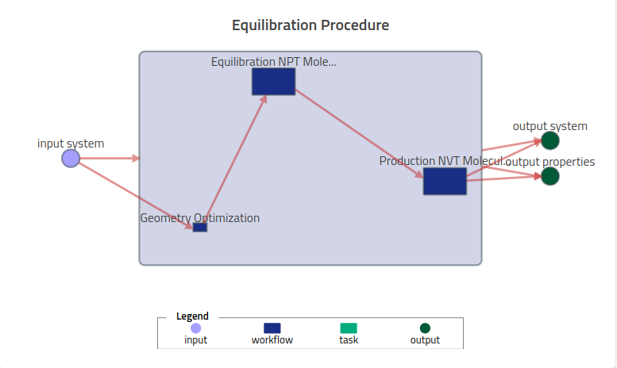
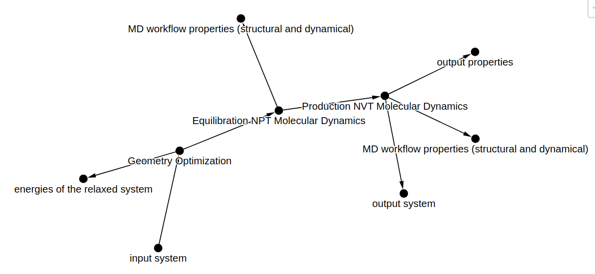
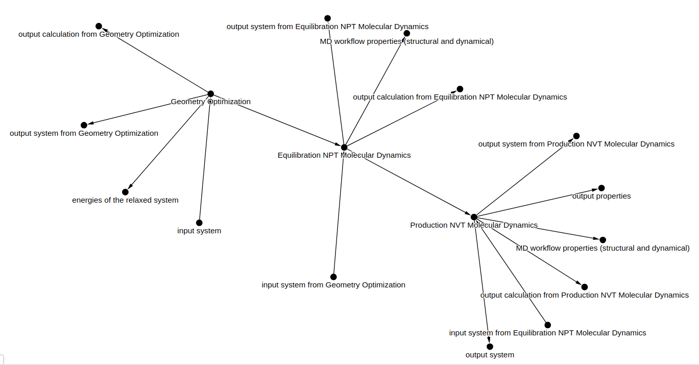

# How to create custom workflows with NOMAD entries

This how-to will walk you through how to use `nomad-utility-workflows` to generate the yaml file required to define a [custom workflow](https://nomad-lab.eu/prod/v1/docs/howto/customization/workflows.html){:target="_blank"}.

## Example Overview

To demonstrate, we will use the following 3 step molecular dynamics equilibration workflow:


1. Geometry optimization (energy minimization)
2. Equilibration MD simulation in NPT ensemble
3. Production MD simulation in NVT ensemble

The final result will be a workflow graph visualization in NOMAD that looks like this:

 {.screenshot}


<!--- TODO: have a link to a comparable self-contained nomad upload. -->

## Prerequisites

* Basic understanding of NOMAD's data model
* Python environment with `nomad-utility-workflows` installed
* Python package `gravis` for visualization
* Simulation data files (provided below)

## Example Data Structure

Each task in this workflow represents a supported entry in NOMAD. All three simulations will be uploaded together with the `workflow.archive.yaml` file, within the following structure:

```
upload.zip
├── workflow.archive.yaml  # The file we'll create in this guide
├── Emin
│   ├── mdrun_Emin.log     # Geometry Optimization mainfile
│   └── ...other raw simulation files
├── Equil_NPT
│   ├── mdrun_Equil-NPT.log  # NPT equilibration mainfile
│   └── ...other raw simulation files
└── Prod_NVT
    ├── mdrun_Prod-NVT.log   # NVT production mainfile
    └── ...other raw simulation files
```

You can download the simulation data from the GitHub repository under [tests/utils/workflow_yaml_examples/water_equilibration/](https://github.com/FAIRmat-NFDI/nomad-utility-workflows/tree/develop/tests/utils/workflow_yaml_examples/water_equilibration){:target="_blank"} in the file `simulation_data.zip`.

## Complete Workflow Creation Example

Let's create the workflow from start to finish. First, import the necessary packages:

```python
import gravis as gv 
import networkx as nx
from nomad_utility_workflows.utils.workflows import build_nomad_workflow, nodes_to_graph
```

### Step 1: Define the workflow structure

We'll define our workflow structure using a dictionary of node attributes:

```python
node_attributes = {
0: {'name': 'input system',
    'type': 'input',
    'path_info': {
        'mainfile_path': 'Emin/mdrun_Emin.log',
        'supersection_index': 0,
        'section_index': 0,
        'section_type': 'system'
    },
    'out_edge_nodes': [1],
},

1: {'name': 'Geometry Optimization',
    'type': 'workflow',
    'entry_type': 'simulation',
    'path_info': {
        'mainfile_path': 'Emin/mdrun_Emin.log'
    }
},

2: {'name': 'Equilibration NPT Molecular Dynamics',
    'type': 'workflow',
    'entry_type': 'simulation',
    'path_info': {
        'mainfile_path': 'Equil_NPT/mdrun_Equil-NPT.log'
    },
    'in_edge_nodes': [1],
},

3: {'name': 'Production NVT Molecular Dynamics',
    'type': 'workflow',
    'entry_type': 'simulation',
    'path_info': {
        'mainfile_path': 'Prod_NVT/mdrun_Prod-NVT.log'
    },
    'in_edge_nodes': [2],
},

4: {'name': 'output system',
    'type': 'output',
    'path_info': {
        'section_type': 'system',
        'mainfile_path': 'Prod_NVT/mdrun_Prod-NVT.log'
    },
    'in_edge_nodes': [3],
},

5: {'name': 'output properties',
    'type': 'output',
    'path_info': {
        'section_type': 'calculation',
        'mainfile_path': 'Prod_NVT/mdrun_Prod-NVT.log'
    },
    'in_edge_nodes': [3],
}
}
```

!!! Note "IMPORTANT"
To ensure that all functionalities work correctly, the node keys **must** be unique integers that index the nodes. For example, `node_keys = [0, 1, 2, 3, 4, 5]` for a graph with 6 nodes.

### Step 2: Create the workflow graph

Now, convert the node attributes dictionary to a graph:

```python
workflow_graph_input = nodes_to_graph(node_attributes)

gv.d3(
    workflow_graph_input,
    node_label_data_source='name',
    edge_label_data_source='name',
    zoom_factor=1.5,
    node_hover_tooltip=True,
)
```

The visualization of the input graph should look like this:

 {.screenshot}


### Step 3: Generate the workflow YAML

Finally, generate the workflow YAML file:

```python
workflow_metadata = {
    'destination_filename': './workflow.archive.yaml',
    'workflow_name': 'Equilibration Procedure',
}

workflow_graph_output = build_nomad_workflow(
    workflow_metadata=workflow_metadata,
    workflow_graph=nx.DiGraph(workflow_graph_input),
    write_to_yaml=True,
)
```

The resulting `workflow.archive.yaml` file will look like this:

```yaml
'workflow2':
  'name': 'Equilibration Procedure'
  'inputs':
  - 'name': 'input system'
    'section': '../upload/archive/mainfile/Emin/mdrun_Emin.log#/run/0/system/0'
  'outputs':
  - 'name': 'MD workflow properties (structural and dynamical)'
    'section': '../upload/archive/mainfile/Prod_NVT/mdrun_Prod-NVT.log#/workflow2/results/-1'
  - 'name': 'output system'
    'section': '../upload/archive/mainfile/Prod_NVT/mdrun_Prod-NVT.log#/run/0/system/-1'
  - 'name': 'output properties'
    'section': '../upload/archive/mainfile/Prod_NVT/mdrun_Prod-NVT.log#/run/0/calculation/-1'
  'tasks':
  - 'm_def': 'nomad.datamodel.metainfo.workflow.TaskReference'
    'name': 'Geometry Optimization'
    'task': '../upload/archive/mainfile/Emin/mdrun_Emin.log#/workflow2'
    'inputs': []
    'outputs':
    - 'name': 'energies of the relaxed system'
      'section': '../upload/archive/mainfile/Emin/mdrun_Emin.log#/run/0/calculation/-1/energy/-1'
    - 'name': 'output system from Geometry Optimization'
      'section': '../upload/archive/mainfile/Emin/mdrun_Emin.log#/run/0/system/-1'
    - 'name': 'output calculation from Geometry Optimization'
      'section': '../upload/archive/mainfile/Emin/mdrun_Emin.log#/run/0/calculation/-1'
  - 'm_def': 'nomad.datamodel.metainfo.workflow.TaskReference'
    'name': 'Equilibration NPT Molecular Dynamics'
    'task': '../upload/archive/mainfile/Equil_NPT/mdrun_Equil-NPT.log#/workflow2'
    'inputs':
    - 'name': 'input system from Geometry Optimization'
      'section': '../upload/archive/mainfile/Emin/mdrun_Emin.log#/run/0/system/-1'
    'outputs':
    - 'name': 'MD workflow properties (structural and dynamical)'
      'section': '../upload/archive/mainfile/Equil_NPT/mdrun_Equil-NPT.log#/workflow2/results/-1'
    - 'name': 'output system from Equilibration NPT Molecular Dynamics'
      'section': '../upload/archive/mainfile/Equil_NPT/mdrun_Equil-NPT.log#/run/0/system/-1'
    - 'name': 'output calculation from Equilibration NPT Molecular Dynamics'
      'section': '../upload/archive/mainfile/Equil_NPT/mdrun_Equil-NPT.log#/run/0/calculation/-1'
  - 'm_def': 'nomad.datamodel.metainfo.workflow.TaskReference'
    'name': 'Production NVT Molecular Dynamics'
    'task': '../upload/archive/mainfile/Prod_NVT/mdrun_Prod-NVT.log#/workflow2'
    'inputs':
    - 'name': 'input system from Equilibration NPT Molecular Dynamics'
      'section': '../upload/archive/mainfile/Equil_NPT/mdrun_Equil-NPT.log#/run/0/system/-1'
    'outputs':
    - 'name': 'MD workflow properties (structural and dynamical)'
      'section': '../upload/archive/mainfile/Prod_NVT/mdrun_Prod-NVT.log#/workflow2/results/-1'
    - 'name': 'output system from Production NVT Molecular Dynamics'
      'section': '../upload/archive/mainfile/Prod_NVT/mdrun_Prod-NVT.log#/run/0/system/-1'
    - 'name': 'output calculation from Production NVT Molecular Dynamics'
      'section': '../upload/archive/mainfile/Prod_NVT/mdrun_Prod-NVT.log#/run/0/calculation/-1'
```


The visualization of the output graph should look like this:

```javascript
gv.d3(
    workflow_graph_output,
    node_label_data_source='name',
    edge_label_data_source='name',
    zoom_factor=1.5,
    node_hover_tooltip=True,
)
```

 {.screenshot}

## Understanding the Workflow Graph

The workflow graph has two representations:


1. **Input graph**: The simplified graph you define with your node attributes
2. **Output graph**: The expanded graph generated by `build_nomad_workflow()` that includes additional nodes and connections

### What happens during graph transformation?

When you run `build_nomad_workflow()`, the function:


1. Adds default input/output nodes for each workflow node
2. Connects these nodes appropriately
3. Generates the YAML representation

For nodes with `entry_type = 'simulation'`, the automatically generated outputs include:

* The [System](https://nomad-lab.eu/prod/v1/gui/analyze/metainfo/runschema/section_definitions@runschema.system.System){:target="_blank"} section
* The [Calculation](https://nomad-lab.eu/prod/v1/gui/analyze/metainfo/runschema/section_definitions@runschema.calculation.Calculation){:target="_blank"} section

## Alternative Approach: Creating a Graph Manually

If you prefer to create the graph structure directly with NetworkX instead of using `nodes_to_graph()`, you can do so:

```python
# Create an empty directed graph
workflow_graph_input = nx.DiGraph()

# Add nodes with attributes
workflow_graph_input.add_node(0, 
    name='input system',
    type='input',
    path_info={
        'mainfile_path': 'Emin/mdrun_Emin.log',
        'supersection_index': 0,
        'section_index': 0,
        'section_type': 'system'
    }
)

workflow_graph_input.add_node(1,
    name='Geometry Optimization',
    type='workflow',
    entry_type='simulation',
    path_info={
        'mainfile_path': 'Emin/mdrun_Emin.log'
    }
)

# Add more nodes...

# Add edges to connect the nodes
workflow_graph_input.add_edge(0, 1)
workflow_graph_input.add_edge(1, 2)
# Add more edges...
```

## Uploading and Viewing Your Workflow

After generating the `workflow.archive.yaml` file:


1. Place it in the root directory of your upload package
2. Ensure all referenced files are in the correct locations
3. Upload the package to NOMAD
4. View the workflow visualization in the workflow entry


## Reference

For more details on node attributes and other options, see:

* [Explanation > Workflow > Node Attributes](../explanation/workflows.md#node-attributes)
* [Reference > Workflows](../reference/workflows.html)


